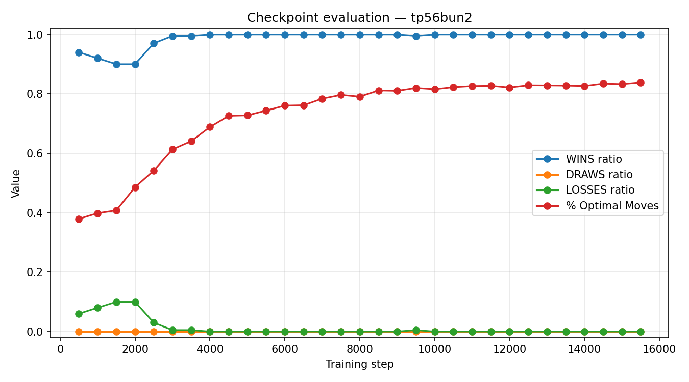

# Evaluation summary — `checkpoints-Connect4/tp56bun2`

- Checkpoints evaluated: **31**
- Step range: **500 → 15500**
- Best `% Optimal Moves` at step **15500**

| Checkpoint | Step | WINS ratio | DRAWS ratio | LOSSES ratio | % Optimal Moves |
|---|---|---|---|---|---|
| ckpt-00000500.pt | 500 | 0.9400 | 0.0000 | 0.0600 | 0.3793 |
| ckpt-00001000.pt | 1000 | 0.9200 | 0.0000 | 0.0800 | 0.3984 |
| ckpt-00001500.pt | 1500 | 0.9000 | 0.0000 | 0.1000 | 0.4079 |
| ckpt-00002000.pt | 2000 | 0.9000 | 0.0000 | 0.1000 | 0.4859 |
| ckpt-00002500.pt | 2500 | 0.9700 | 0.0000 | 0.0300 | 0.5416 |
| ckpt-00003000.pt | 3000 | 0.9950 | 0.0000 | 0.0050 | 0.6130 |
| ckpt-00003500.pt | 3500 | 0.9950 | 0.0000 | 0.0050 | 0.6410 |
| ckpt-00004000.pt | 4000 | 1.0000 | 0.0000 | 0.0000 | 0.6883 |
| ckpt-00004500.pt | 4500 | 1.0000 | 0.0000 | 0.0000 | 0.7262 |
| ckpt-00005000.pt | 5000 | 1.0000 | 0.0000 | 0.0000 | 0.7277 |
| ckpt-00005500.pt | 5500 | 1.0000 | 0.0000 | 0.0000 | 0.7438 |
| ckpt-00006000.pt | 6000 | 1.0000 | 0.0000 | 0.0000 | 0.7604 |
| ckpt-00006500.pt | 6500 | 1.0000 | 0.0000 | 0.0000 | 0.7618 |
| ckpt-00007000.pt | 7000 | 1.0000 | 0.0000 | 0.0000 | 0.7841 |
| ckpt-00007500.pt | 7500 | 1.0000 | 0.0000 | 0.0000 | 0.7965 |
| ckpt-00008000.pt | 8000 | 1.0000 | 0.0000 | 0.0000 | 0.7908 |
| ckpt-00008500.pt | 8500 | 1.0000 | 0.0000 | 0.0000 | 0.8116 |
| ckpt-00009000.pt | 9000 | 1.0000 | 0.0000 | 0.0000 | 0.8104 |
| ckpt-00009500.pt | 9500 | 0.9950 | 0.0000 | 0.0050 | 0.8200 |
| ckpt-00010000.pt | 10000 | 1.0000 | 0.0000 | 0.0000 | 0.8157 |
| ckpt-00010500.pt | 10500 | 1.0000 | 0.0000 | 0.0000 | 0.8229 |
| ckpt-00011000.pt | 11000 | 1.0000 | 0.0000 | 0.0000 | 0.8265 |
| ckpt-00011500.pt | 11500 | 1.0000 | 0.0000 | 0.0000 | 0.8273 |
| ckpt-00012000.pt | 12000 | 1.0000 | 0.0000 | 0.0000 | 0.8217 |
| ckpt-00012500.pt | 12500 | 1.0000 | 0.0000 | 0.0000 | 0.8292 |
| ckpt-00013000.pt | 13000 | 1.0000 | 0.0000 | 0.0000 | 0.8287 |
| ckpt-00013500.pt | 13500 | 1.0000 | 0.0000 | 0.0000 | 0.8281 |
| ckpt-00014000.pt | 14000 | 1.0000 | 0.0000 | 0.0000 | 0.8267 |
| ckpt-00014500.pt | 14500 | 1.0000 | 0.0000 | 0.0000 | 0.8348 |
| ckpt-00015000.pt | 15000 | 1.0000 | 0.0000 | 0.0000 | 0.8330 |
| ckpt-00015500.pt | 15500 | 1.0000 | 0.0000 | 0.0000 | 0.8388 |
